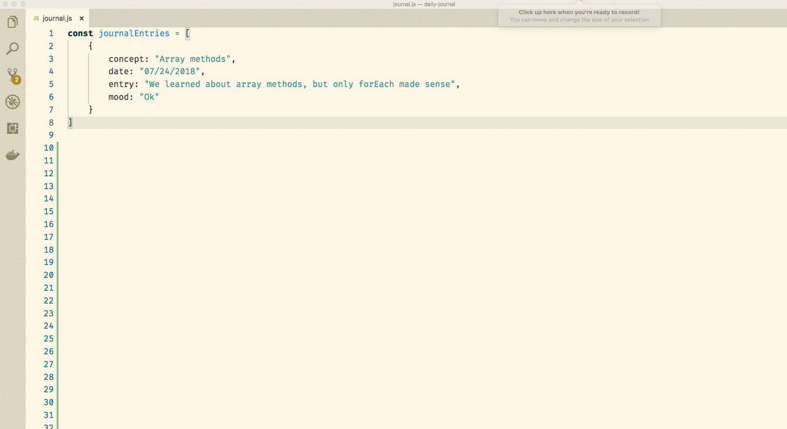
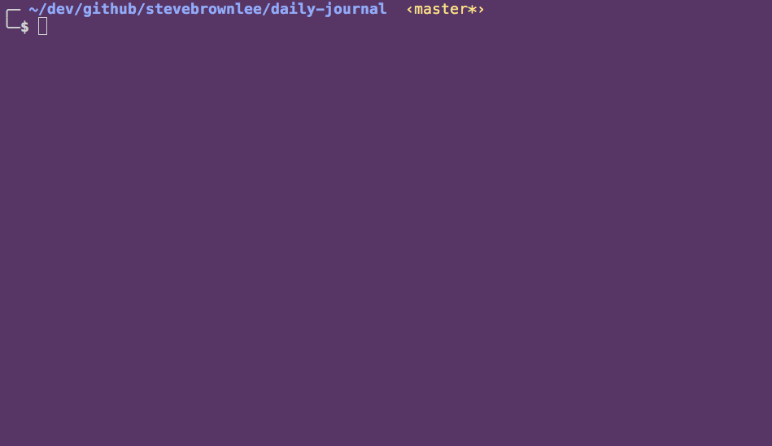
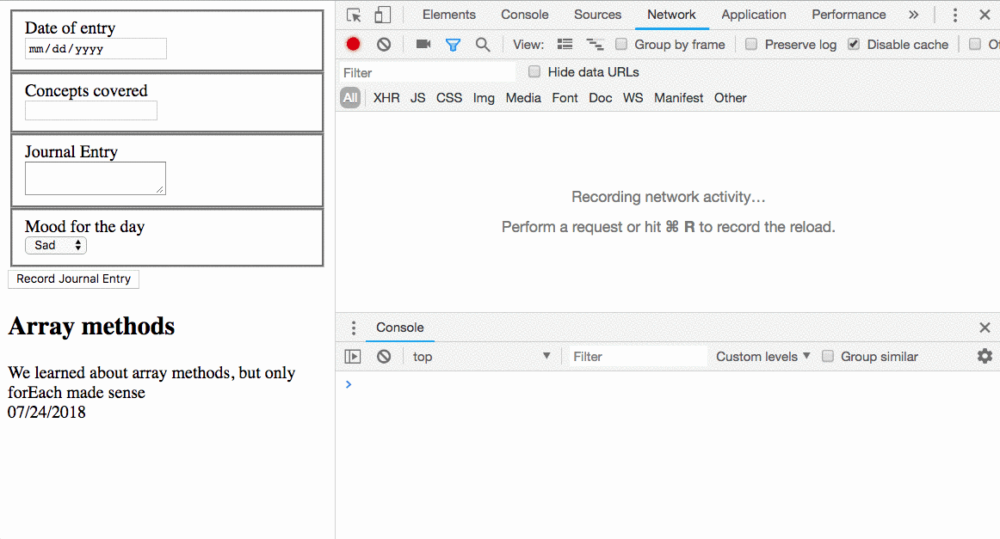

# Daily Journal

Your learning objective in this chapter is to set up JSON Server to store the data for your daily journal entries, query that data from the API, and then use your knowledge of Promises (_remember, `fetch` is a fancy Promise_) and `then()` to render the entries to the DOM.

## Setting up a JSON Server API

The [json-server](https://github.com/typicode/json-server) library was written to allow developers to quickly build an API to use as persistant storage while developing applications. You are going to expose your journal entries via an API, request that API over HTTP, and then populate your DOM when the data comes back in a response.


### Journal Entries as JSON

In the root directory, create a new directory in your project named `api`, and create a new file in that directory named `entries.json`.

```sh
mkdir api
touch api/entries.json
```


Your next step is to copy the array of entries that you have in data provider, and transplant it to `api/entries.json` as a JSON object.

> #### `daily-journal/api/entries.json`

```json
{
    "entries": [
        // Remove this comment and paste all of your objects here
    ]
}
```

When working with **Official JSON Objects**, all keys should be strings so put double quotes around them.



As mentioned previously in [Chapter 9 - Building and Using an API](./chapters/JSON_SERVER_API.md), each object should have a unique ID. At this point, once you've transplanted your journal entries into `api/entries.json`, make sure to add unique integer IDs to each entry like the following example.
```
{
  "id": 1,
  "concept": "Array methods",
  "date": "08/06/19",
  "entry": "We learned about array methods.",
  "mood": "ok"
}
```

### Starting the Server

Now you run the `json-server` command with the arguments below in the `api` directory.

```sh
cd api
json-server -w entries.json -p 8088
```



Go to your browser now, and visit the URL listed in the output. It should be `http://localhost:8088`. Then click on the hyperlink for `entries` and you should see the objects that you created.


## Using `fetch()` to Query Data

> **Refactor:** At this point, the `journal` variable in your data provider should be initialized as an empty array. You are now going to get the data from your API server.

Since you are now simulating the scenario that your data now lives _somewhere else on the Web_ you need to use the [fetch()](https://learn.co/lessons/javascript-fetch) command in JavaScript.

> #### `daily-journal/scripts/JournalDataProvider.js`

```js
export const getEntries = () => {
    return fetch("http://localhost:8088/entries") // Fetch from the API
        .then()  // Parse as JSON
        .then(entries => {
            // What should happen when we finally have the array?
        })
}
```

## Viewing the Response

Once you have your fetch written correctly, refresh your browser and go to the Network tab in your dev tools. You will see an entry labeled `fetch`. If you click on that request, you can preview the response.



## Printing the Response
Once you've confirmed that the data is coming back correctly from your `fetch`, call the printer functions you wrote in previous Daily Journal exercises to print the data from your json-server API to the DOM.
