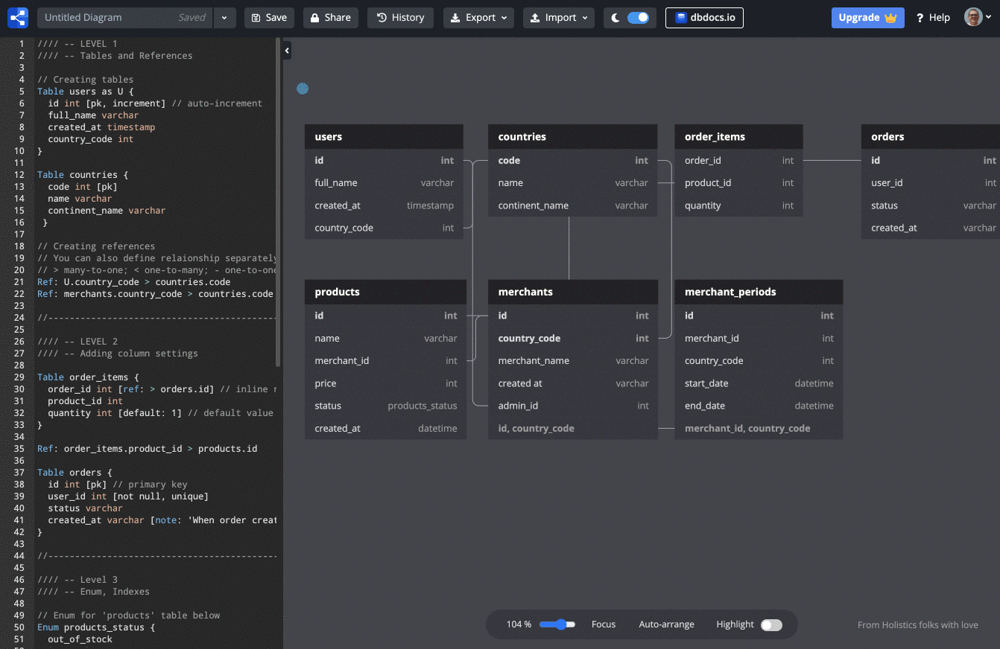

# Entity Relationship Diagrams

In this chapter, you are going to use, discuss, and learn how to create your first Entity Relationship Diagram (ERD). An ERD is a vital tool for software developers so that the data and the relationships between them can be visualized.

## Learning Objectives

* You should be able to explain the purpose of an ERD.
* You should be able to identify resources, fields, primary keys, and foreign keys on an ERD.
* You should be able to define resources, their fields, and their relationships in dbdiagram.
* You should be able to explain what a _1 -> many_ relationship is.
* You should be able to explain what a _many -> many_ relationship is.

## Videos to Watch Before Class

### Databases and Normalization

1. [Database Tutorial for Beginners](https://www.youtube.com/watch?v=wR0jg0eQsZA)
1. [Basic Concept of Database Normalization - Simple Explanation for Beginners](https://www.youtube.com/watch?v=xoTyrdT9SZI)

### Entity Relationship Diagrams

1. [Entity Relationship Diagram (ERD) Tutorial - Part 1](https://www.youtube.com/watch?v=QpdhBUYk7Kk)
1. [Entity Relationship Diagram (ERD) Tutorial - Part 2](https://www.youtube.com/watch?v=-CuY5ADwn24)

## Posts, Users, and Likes Visualization

In the previous few chapters, you created three different colletions in your data store module.

1. Users
1. Posts
1. Likes

There are relationships between these entities, and those relationships are established by using the primary key _(the `id` property)_ from an object in one collection and storing it as a foreign key on an object in another collection _(e.g. the `userId` property on a Post object)_.

You are going to visualize these relationships with [dbdiagram](https://dbdiagram.io/). If you didn't do it during initial installations and setup of your computer, go to that site and now register an account.

To start, go to the dbdiagram app and create a new ERD.

Paste the following code into the bar on the left and see your first, simple ERD. Your instruction team discuss how to use dbdiagram and how to identify and design the relationships between the data.

```html
Table Users {
    id int pk
    name varchar
    email varchar
    password varchar
}

Table Posts {
    id int
    userId int
    title varchar
    imageURL varchar
    description varchar
    timestamp date
}

Table UserLikes {
    id int
    userId int
    postId int
}

Ref: "Users"."id" < "Posts"."userId"
Ref: "Users"."id" < "UserLikes"."userId"
Ref: "Posts"."id" < "UserLikes"."postId"
```


