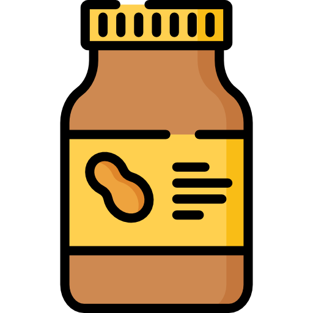

# Navigation Bar Component


## Learning Objectives


## Setup

1. Be in the `giffygram/src` directory and run these commands
    ```sh
    mkdir nav
    touch NavBar.js
    ```

1. Right-click the image below and save it in the `nav` directory.
    
1. Copy and paste the following code into the `NavBar.js` file.
    ```js
    export const NavBar = () => {
        return `
            <nav class="navigation">
                <div class="navigation__item navigation__icon">
                    
                </div>
                <div class="navigation__item navigation__name">
                    Giffygram
                </div>
                <div class="navigation__item navigation__message">
                    
                </div>
                <div class="navigation__item navigation__logout">
                    <button id="logout" class="fakeLink">Logout</button>
                </div>
            </nav>
        `
    }
    ```
## Including a Component in Another One

1. Open the `GiffyGram.js` file
1. Import the `NavBar.js` file
1. Change the following line of code...
    ```js
    let htmlStringOfAllPosts = ""
    ```
    with this string interpolation code
    ```js
    let htmlStringOfAllPosts = `${NavBar()}`
    ```
1. Refresh your browser.

You just imported a function from another module, invoked it, and interpolated its return value into a string.

The more explicit version of the code would look like this.

```js
const navBarHTML = NavBar()
let htmlStringOfAllPosts = navBarHTML
```

## You Can Try...

You'll be shown how to do it in a future chapter, but see if you can make a footer component for your application in a `nav/Footer.js` file. For now, just display your name and the current year in it.

Look in the `styles/footer.css` file to see a style that you can apply to your footer element.
