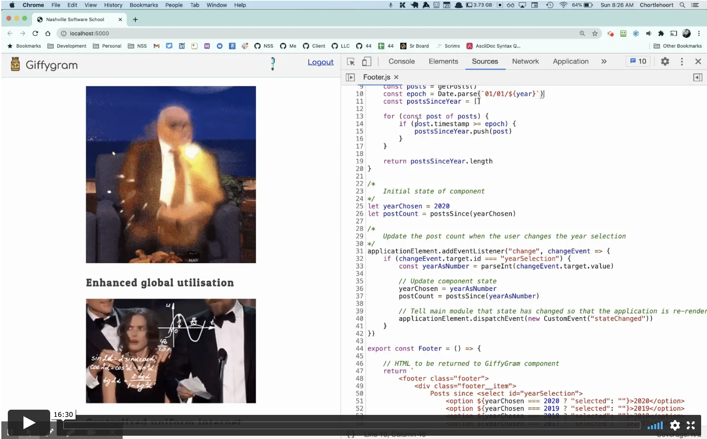

# Browser Events and the Footer Component

You may have implemented a **`Footer`** component in a previous chapter as a personal challenge. If you did, it was fairly simplistic and you will make it more complex in this chapter. If you didn't make that component then this is all brand new to you!

| | |
|:---:|:---|
| <h1>&#x270e;</h1> |  _A footer element is the name for a component that is at the bottom of a web page_ |

## More Data

Visit the [morePosts.js](./data/morePosts.js) file and copy pasta the array of users and posts into your `giffygram/src/store/index.js` file so that you have a bit more data to work with.

## Footer Component

Here is the code you need for the **`Footer`** component. After you have the

> #### `giffygram/src/scripts/nav/Footer.js`

```js
import { getPosts } from "../store/index.js"

const applicationElement = document.querySelector(".giffygram")

/*
    Calculate the number of posts since a given year
*/
const postsSince = (year) => {
    const posts = getPosts()
    const epoch = Date.parse(`01/01/${year}`)
    const postsSinceYear = []

    for (const post of posts) {
        if (post.timestamp >= epoch) {
            postsSinceYear.push(post)
        }
    }

    return postsSinceYear.length
}

/*
    Initial state of post count
*/
let postCount = postsSince(2020)

/*
    Update the post count when the user changes the year selection
*/
applicationElement.addEventListener("change", changeEvent => {
    if (changeEvent.target.id === "yearSelection") {
        const yearAsNumber = parseInt(changeEvent.target.value)

        postCount = postsSince(yearAsNumber)
        applicationElement.dispatchEvent(new CustomEvent("stateChanged"))
    }
})

export const Footer = () => {

    // HTML to be returned to GiffyGram component
    return `
        <footer class="footer">
            <div class="footer__item">
                Posts since <select id="yearSelection">
                    <option>2020</option>
                    <option>2019</option>
                    <option>2018</option>
                    <option>2017</option>
                </select>
                <span id="postCount">${postCount}</span>
            </div>
        </footer>
    `
}
```

Next, import this new component function into the GiffyGram module and invoke it last in the order of components.

> #### `giffygram/src/scripts/GiffyGram.js`

```js
import { PostList } from "./feed/PostList.js"
import { Footer } from "./nav/Footer.js"
import { NavBar } from "./nav/NavBar.js"

export const GiffyGram = () => {
    const giffyGramHTML = `
        ${ NavBar() }
        ${ PostList() }
        ${ Footer() }
    `

    return giffyGramHTML
}
```

## Events

There are several new concepts being introduced with this code. You likely immediately noticed that the code is far more complex that what you did in the **`PostList`** component. The following video will explain what is going on.


[](https://vimeo.com/515018310)


