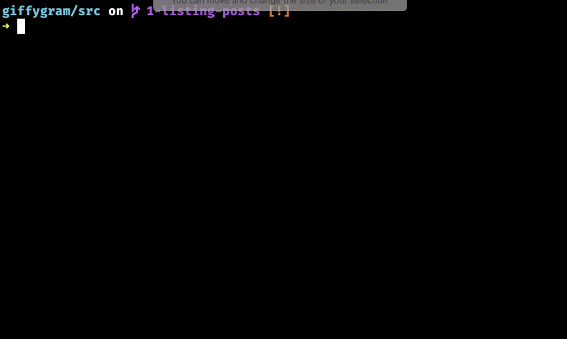

# Express Yourself

## Learning Objectives

* You should be able to remember that the HTML that a person sees in the browser is an expression of the state of your raw data.
* You should be able to define what a JavaScript module is.
* You should be able to describe how functions get exported and imported into different modules.
* You should be able to explain what the [document.querySelector()](https://www.youtube.com/watch?v=3oOKAJTD2F8) method does.
* You should be able to describe how to change the browser contents with [innerHTML](https://www.youtube.com/watch?v=1UsllDMhvN4).
* You should be able to differentiate between assignment with a single `=` and appending with `+=`.

## Data as HTML

A phrase you will see as you explore the World Wide Web as a software developer is...

> &#x275d; Your job as a web application developer is to express data as HTML. &#x275e;

It may seem like an odd way to say that, but what it means is that your code's sole purpose is to take raw data and make it look pretty in a Web browser.

For example, your code turns this raw data 👇🏽

```js
posts = [
    {
        id: 2,
        imageURL: "https://media.giphy.com/media/26xBI73gWquCBBCDe/giphy.gif",
        userId: 6,
        description: "Proin eu mi. Nulla ac enim. In tempor, turpis nec euismod scelerisque, quam turpis adipiscing lorem, vitae mattis nibh ligula nec sem.\n\nDuis aliquam convallis nunc. Proin at turpis a pede posuere nonummy. Integer non velit.",
        timestamp: 1561695022812,
        title: "Enhanced global utilisation"
    }
],
likes: [
    {
        id: 1,
        userId: 1,
        postId: 2
    }
]
```

Into this HTML representation of it in the Web browser 👇🏽


The data has been beautifully expressed as HTML so that a person can understand it and interact with it.

## Your Main Module


Every application needs an HTML file so that your data can be displayed beautifully. That file will be `index.html`.

> #### `giffygram/src/index.html`

```html
<!doctype html>
<html lang="en">

<head>
    <meta charset="utf-8">
    <title>Nashville Software School</title>
    <link rel="stylesheet" href="./styles/main.css">
</head>

<body>

    <main class="giffygram"></main>

    <script type="module" src="./scripts/main.js"></script>
</body>

</html>
```


| | |
|:---:|:---|
| <h1>&#x270e;</h1> |  _If you have multiple files of JavaScript code, and they export and import code from each other, they are called modules._ |

Your code has to start somewhere. For this application, it is going to start in a file called `main.js`. This file is the top-level [_module_ of code](https://javascript.info/modules-intro#what-is-a-module), and it will import code from other modules.


Note the `<script>` tag in the HTML file above. That is how you will run your JavaScript code that will convert your raw data to be beautifully expressed as HTML.

> #### `giffygram/src/scripts/main.js`

```js
// Can you explain what is being imported?
import { GiffyGram } from "./GiffyGram.js"

// What HTML element is being in the following variable?
const applicationElement = document.querySelector(".giffygram")

/*
    This function performs one, specific task.

    1. Can you explain what that task is?
    2. Are you defining the function here or invoking it?
*/
const renderApp = () => {
    applicationElement.innerHTML = GiffyGram()
}

// Are you defining the function here or invoking it?
renderApp()
```

The other file you will need is the **`GiffyGram`** component, whose Sole Reponsbility is to display the posts - at least for now. You are starting off with the simple stuff.

There are concept checking questions sprinkled throughout the file. You should ponder these yourself, discuss them with your teammates, or discuss with instructors.

> #### `giffygram/src/scripts/GiffyGram.js`

```js
// Can you explain what is being imported here?
import { getPosts } from "./store/index.js"

// This function is being exported. What module is importing it?
export const GiffyGram = () => {
    // getPosts() is not defined in this module. How are you able to invoke it?
    const allPosts = getPosts()
    let giffyGramHTML = ""

    // Which variable below has a value of an array?
    for (const postObject of allPosts) {

        // What is the scope of this variable?
        const htmlRepresentationOfThisPost = `
            <section class="post">
                <header>
                    <h2 class="post__title">${postObject.title}</h2>
                </header>
                
            </section>
        `

        // What is the difference between = and += operators?
        giffyGramHTML += htmlRepresentationOfThisPost
    }

    /*
        This is the return statement for the GiffyGram function.

        What data type does the function return?
    */
    return giffyGramHTML
}
```

Then start your Web server with the `serve` command in the terminal. Make sure you are in the `giffygram/src` directory when you do it.



Now go to Chrome and paste with `Ctrl+V` on Windows or `Cmd+V` on Mac. Then hit enter and you should see a single post for Giffygram appear in the browser.


## Displaying More Properties as HTML

In the next couple chapters, you will see more comprehensive code for displaying the properties of a Post as HTML, but you are encouraged to give it a shot first.

Open `src/GiffyGram.js` and add more HTML structure, and interpolate the `description`, `timestamp`, and/or the `userId` property in it.