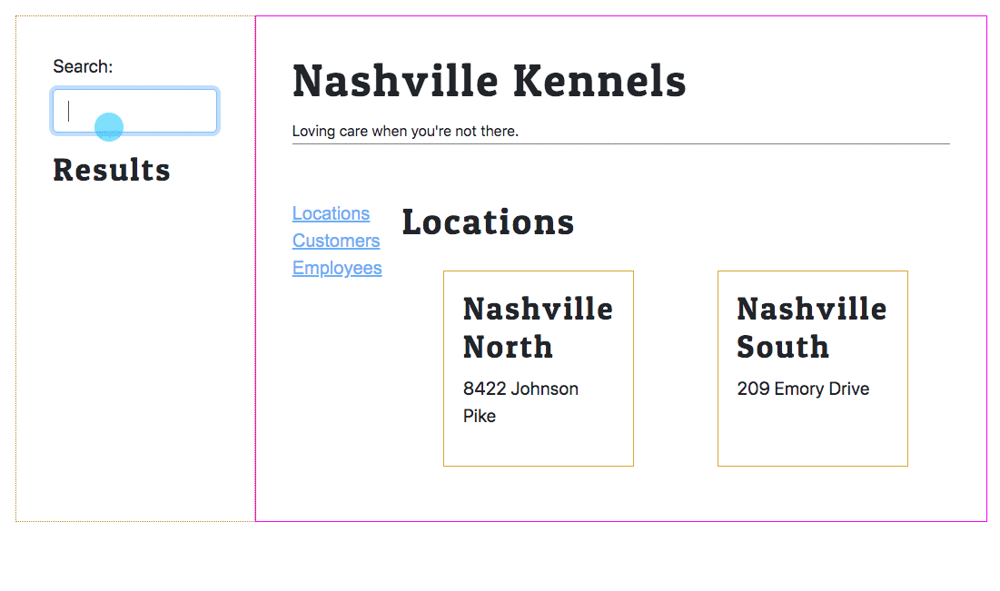

# Viewing Animal Details in Modal

## Setup

In your **`Dashboard`** component, remove the **`AnimalList`** component. All animals will no longer be displayed by default. Users will have to search for animal name.

## Instructions

In this chapter, you will change how the modal for animal details works. Instead of having an animal list in the right container of the application, search will be the only way to find an animal.

Then, you can click on an animal and see the details of it.



## Update Search Results

Update the **`SearchResults`** component with the code below so that the animal is a fake link, and has an `onClick` attribute. When you click on an animal, a modal should appear with the details.

Your instructor will walk you through the new things introduced here.

1. The spread operator `{...selectedAnimal}`
1. The default value of the `selectedAnimal` state variable.

##### **`src/components/search/SearchResults.js`**

```js
import React, { useState, useContext, useEffect } from "react"
import { AnimalContext } from "../animal/AnimalProvider"
import { AnimalCard } from "../animal/Animal"
import { CustomerContext } from "../customer/CustomerProvider"
import { LocationContext } from "../location/LocationProvider"
import { Modal, ModalHeader, ModalBody } from "reactstrap"


export const SearchResults = ({ searchTerms }) => {
    const { animals } = useContext(AnimalContext)
    const { customers } = useContext(CustomerContext)
    const { locations } = useContext(LocationContext)

    const [filteredAnimals, setFiltered] = useState([])
    const [selectedAnimal, setAnimal] = useState({animal: {id:0}, location: null, customer: null})

    const [modal, setModal] = useState(false)
    const toggle = () => setModal(!modal)

    useEffect(() => {
        if (searchTerms !== "") {
            const subset = animals.filter(animal => animal.name.toLowerCase().includes(searchTerms))
            setFiltered(subset)
        } else {
            setFiltered([])
        }
    }, [searchTerms, animals])

    return (
        <div className="searchResults">
            <h3>Results</h3>
            <div className="animals">
                {
                    filteredAnimals.map(animal => <div
                        className="fakeLink href"
                        onClick={() => {
                            const location = locations.find(l => l.id === animal.locationId)
                            const customer = customers.find(c => c.id === animal.customerId)

                            setAnimal({ animal, location, customer })
                            toggle()
                        }}
                    >{animal.name}</div>)
                }
            </div>

            <Modal isOpen={modal} toggle={toggle}>
                <ModalHeader toggle={toggle}>
                    { selectedAnimal.animal.name }
                </ModalHeader>
                <ModalBody>
                    <AnimalCard key={selectedAnimal.animal.id} {...selectedAnimal} />
                </ModalBody>
            </Modal>
        </div>
    )
}
```
