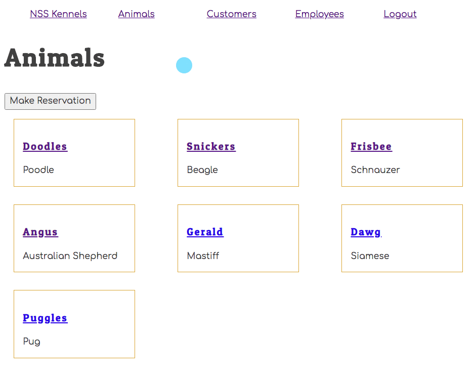

# Individual Items with Nested Data

In this chapter, you are again going to take advantage of one of the features of `json-server` to get nested data back from the API: `_expand`.

## Getting the Nested Data

Since the animal detail component is responsible for showing data about an animal, as well as its related owner and location data objects embedded inside the response. Our use of `_expand` to get the nested related data back in one query looks like this.

> ##### `/src/components/animal/AnimalProvider.js`

```js
const getAnimalById = (id) => {
    return fetch(`http://localhost:8088/animals/${id}?_expand=location&_expand=customer`)
        .then(res => res.json())
}
```
Be sure to update the return statement as well, and include this method in the export of the provider
```js
<AnimalContext.Provider value={{
    animals, addAnimal, getAnimals, getAnimalById
    }}>
        {props.children}
</AnimalContext.Provider>
```

The response for an animal will include objects for the location and customer information.

```json
{
  "id": 2,
  "name": "Snickers",
  "breed": "Beagle",
  "locationId": 2,
  "treatment": "React Hook useEffect has a missing dependency: 'setDefaults'. Either include it or",
  "customerId": 4,
  "location": {
    "id": 2,
    "name": "Nashville South",
    "address": "209 Emory Drive"
  },
  "customer": {
    "email": "steve@stevebrownlee.com",
    "name": "Steve Brownlee",
    "id": 4
  }
}
```

The server (API) did the work for you!!

## AnimalCard inside of AnimalList Refactor

Change the AnimalCard to display animal names as hyperlinks. When you click on one animal name, an animal detail component will render.

> ##### `/src/components/animal/Animal.js`

```jsx
import React from "react"
import "./Animal.css"
import { Link } from "react-router-dom"


export const AnimalCard = ({ animal }) => {
  return (
    <section className="animal">
      <h3 className="animal__name">
        <Link to={`/animals/detail/${animal.id}`}>
          { animal.name }
        </Link>
      </h3>
      <div className="animal__breed">{ animal.breed }</div>
  </section>
)}
```

## New Animal Details Component

Create a new component in the animal directory which will be responsible for showing all the details of an animal. Consider the flow of a React component. What will you need to store as state? Will you need `useEffect`?

We will also include `useParams` from react-router-dom allowing the app to read a parameter from the URL.

> ##### `/src/components/animal/AnimalDetail.js`

```jsx
import React, { useContext, useEffect, useState } from "react"
import { AnimalContext } from "./AnimalProvider"
import "./Animal.css"
import { useParams, useHistory } from "react-router-dom"

export const AnimalDetail = () => {
  const { getAnimalById } = useContext(AnimalContext)

	const [animal, setAnimal] = useState({})

	const {animalId} = useParams();
	const history = useHistory();

  useEffect(() => {
    console.log("useEffect", animalId)
    getAnimalById(animalId)
    .then((response) => {
      setAnimal(response)
    })
    }, [])

  return (
    <section className="animal">
      <h3 className="animal__name">{animal.name}</h3>
      <div className="animal__breed">{animal.breed}</div>
      {/* What's up with the question mark???? See below.*/}
      <div className="animal__location">Location: {animal.location?.name}</div>
      <div className="animal__owner">Customer: {animal.customer?.name}</div>
    </section>
  )
}
```
Immediate properties of an empty object will not break if you try to reference that property but it doesn't actually exist, however nested properties of an empty object will. Use the [Optional chaining (?.)](https://developer.mozilla.org/en-US/docs/Web/JavaScript/Reference/Operators/Optional_chaining) operator to prevent nested values from breaking the code. Try replacing "name" with "foo" in the code above ( since `location` and `customer` don't have a "foo" property ). Try it with and without the `?.` One will cause an error and the other won't.

## Create a New Dynamic Route

A dynamic route component is one that matches a pattern instead of a specific hard-coded route name. Notice the route that renders **`AnimalDetail`**. `animalId` is not literally ever going to show up in a link or URL. It's a parameter passed on the URL. Yeah, confusing as heck. Bear with us...

```js
<Route exact path="/animals/detail/:animalId(\d+)">
    <AnimalDetail />
</Route>
```

You put `:animalId(\d+)` at the end of the URL to serve as a variable to hold the _actual_ value that will be in the URL. For example, if the URL is http://localhost:3000/animals/detail/3, the value of 3 will be stored in that variable named `animalId`. The variable can then be accessed and used inside **`AnimalDetail`**.

Look back at the code you put in the detail component.

See the `const {animalId} = useParams();`

This is how you access the number 3 inside the component. Now, no matter which animal detail the user wants to view by clicking on any animal's detail link in the list of animals, this one path with match any and all of them, whether there are two animals or two million. It's part of the routing package (react-router-dom) you installed. Don't worry, that one's tricky. We'll help you remember it.


Within ApplicationViews, add the route for animal details within the **AnimalProvider** component. You will need to support a route like the following.

http://localhost:3000/animals/detail/7

> ##### `/src/components/ApplicationViews.js`

```js
<AnimalProvider>
   <Route exact path="/animals/detail/:animalId(\d+)">
		<AnimalDetail />
	</Route>
</AnimalProvider>
```

## Try it Out

Now when you click on an animal's name in the list view, you should see your new animal detail view.



## Practice: Employees

Refactor your employee components. Start with a list of employee names that when clicked, displays the full details about an employee.

## Practice: Locations
Refactor your location components. Start with your location list and display the location name, the number of employees, and the number of animals currently being treated for each location.

When you click the name of a location, you should be taken to a detail view that lists the names of all animals currently being treated, and the names of all employees working there. You can use the json-server feature: `_embed`.

Your starting API call will look similar to this:

```js
http://localhost:8088/locations?_embed=employees_embed=animals

```

How do you return the information about one location?

> **Tip:** You don't need all of the fancy styling like you see below. Just get the information displayed.


