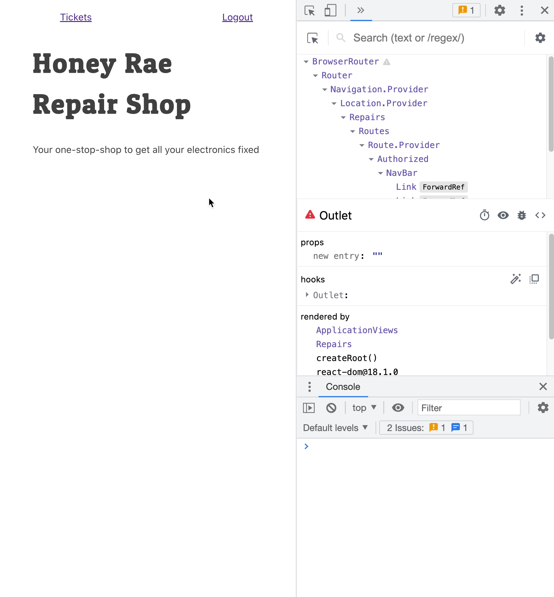

# Displaying Tickets

## Component State

For basic applications like Honey Rae's, state will be managed at the component level. Each component will fetch the data it needs to display in the DOM, and then manipulate that state depending on user interactions.

The React library provides you with a function named `useState()` to store the state in a component. The function returns an array. The array contains the intial state value at index 0 and a function that modifies the state at index 1.

You deconstruct those values into two variables.

```js
const [ tickets, setTickets ] = useState([])
```

After this line of code runs, you have two variables with the following values.

1. `tickets` has a value of an empty array.
1. `setTickets` has a value of a function.

This is the initial change of state in a component.

## Observing State

React provides you with another function named `useEffect()` to _**observe**_ state. It allows you to observe state and run some instructions when state changes.

Since the `useState` function performs the first change in state, you can observe that.

```js
useEffect(
    () => {
        console.log(tickets) // View the initial state of tickets
    },
    [] // When this array is empty, you are observing initial component state
)
```

Copy the code below as the new content for the `TicketList` component.

```js
import { useEffect, useState } from "react"

export const TicketList = () => {
    const [tickets, setTickets] = useState([])

    useEffect(
        () => {
            console.log("Initial state of tickets", tickets) // View the initial state of tickets
        },
        [] // When this array is empty, you are observing initial component state
    )
    return <h2>List of Tickets</h2>
}
```

## Ticket List Route

The final step is to render the **`<TicketList>`** component. You do that with a **`<Route>`** component. Open your **`<ApplicationViews>`** component and replace its contents with the following code.

```js
import { Outlet, Route, Routes } from "react-router-dom"
import { TicketList } from "../tickets/TicketList"

export const ApplicationViews = () => {
	return (
        <Routes>
            <Route path="/" element={
                <>
                    <h1>Honey Rae Repair Shop</h1>
                    <div>Your one-stop-shop to get all your electronics fixed</div>

                    <Outlet />
                </>
            }>

                <Route path="tickets" element={ <TicketList /> } />
            </Route>
        </Routes>
    )
}
```

Now you can use your Dev Tools to see the message in the console, and view the initial state of your component.



## React Developer Tools

> This is not by mistake. We want to make sure everyone watches this video, but more importantly, starts using the React developer panel.

Watch the Intro to React Dev Tools video below to review their usage. Again, just like with VanillaJS, your use of the React dev tools is the only other way than using the debugger to gather evidence.

[](https://www.youtube.com/watch?v=rb1GWqCJid4)

