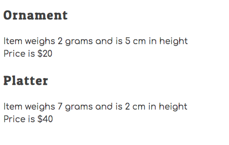
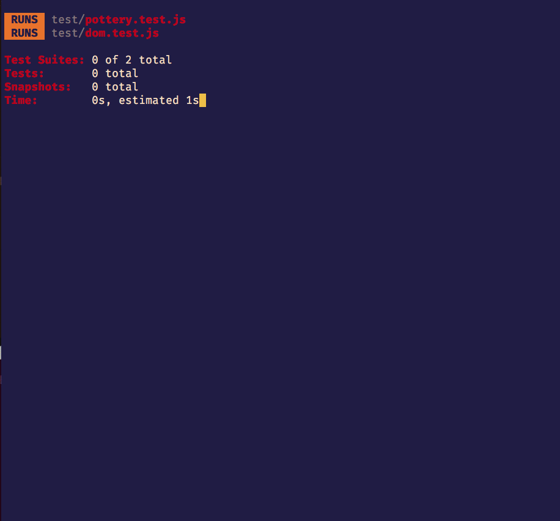

# Core JavaScript Review

## The Hairy Potter

In this exercise, your task to build a workflow for making, and firing pottery, and then determining if it should be sold at a craft show. Then you will display the pottery to be sold in the DOM.

## Setup

1. Open a new terminal window, copy pasta the following command into the terminal and hit enter to run it. It will create a basic file structure for you and create some starter code in the `~/workspace/hairy-potter-project` directory.

    ```sh
    /bin/bash -c "$(curl -fsSL https://raw.githubusercontent.com/nashville-software-school/client-side-mastery/cohort-56/projects/tier-1/hairy-potter/chapters/scripts/hairy-potter-install.sh)"
    ```

1. Create a Github repository for this project and run the recommended commands to connect your local repository with the Github repository.
1. Run the following command in your terminal to change directory to the project directory.

    ```sh
    cd ~/workspace/hairy-potter-project/src
    ```

1. Open the project for editing with the `code .` command.
1. Run the `serve` command to start the web server.
1. Open the URL provided by `serve` in your browser.
1. Open another new terminal session _(yes, there will be two terminal sessions needed for this project)_ and make sure you are in the the `hairy-potter-project` directory and not in the `src` sub-directory.
    ```sh
    cd ~/workspace/hairy-potter-project
    ```

1. Run the `npm install` command to install all of the tools used for this project.
1. Once the installations are complete, run the `npm run test` command (_see animation below_). You will see all of the tests for your code - which ones pass, and which ones fail. As soon as you make changes to your code, the tests will run automatically, so keep this terminal window open while you are working on this project. When you need to stop working on it, use the `Ctrl+C` keyboard shortcut to stop the tests from running.

    

> **Note:** All of the code for this project will be created the `src` directory of the project. Open a new terminal session, and `cd` to the project directory. Then you can `cd src` to change to that directory in your terminal. To check what's already in the `src` directory, use the `ls` command to see its contents.

## Making Pottery at the Wheel

1. Create a `scripts/PotteryWheel.js` module.
1. Define a variable in the module to have the value of the primary key for each piece of pottery. It should have an initial value of 1.
1. Define and export a function named `makePottery`.
1. The `makePottery` function must accept the following values as input _(i.e. it needs parameters)_, in the following order.
    1. Shape of the piece of pottery (e.g. "Mug", "Platter")
    1. Weight of the piece (e.g. 1, 5)
    1. Height of the piece (e.g. 3, 7)
1. The `makePottery` function must return an object with the following properties on it.
    1. `shape`
    1. `weight`
    1. `height`
    1. `id` _(increment this value each time the function is invoked)_

#### Checking Your Work

In the `main.js` module, invoke the `makePottery` function and provide the required values as arguments. Store the object that gets returned into a variable, and then use `console.log()` to view the object.

Once you have it working, make 5 pieces of pottery in `main.js`.

**THEN PUSH YOUR CODE TO GITHUB**

## Firing the Pottery in the Kiln

1. Define a `scripts/Kiln.js` module.
1. Define and export a function named `firePottery` that is responsible for acting as a kiln.
1. The function must accept the following values as input _(i.e. it needs parameters)_, in the following order. If you don't remember, you can easily [add new properties to objects in JavaScript](https://www.dyn-web.com/tutorials/object-literal/properties.php).
    1. An object representing a piece of pottery that was made at the wheel in the `makePottery` function.
    1. A number specifying the firing temperature of the kiln.
1. The function must add a new property of `fired` with the value of `true` to the object.
1. The function must add a new property of `cracked` to the object.
    1. If the temperature of the kiln is above 2200 degrees then `cracked` property must have a value of `true`.
    1. If the temperature of the kiln is at, or below,  2200 degrees then `cracked` property must have a value of `false`.
1. After both of the new properties have been added, return the augmented object.

#### Checking Your Work

In the `main.js` module, invoke the `firePottery` function for each of the 5 pieces of pottery you created. Ensure you provide the required values as arguments. Store the object that gets returned into a variable, and then use `console.log()` to view the objects and make sure it has the right properties on each.

To check your work, make sure that at least one of your pieces of pottery is fired at a temperature that is too high.

**THEN PUSH YOUR CODE TO GITHUB**

## Pricing Uncracked Pottery

1. Create a `scripts/PotteryCatalog.js` module.
1. Define a variable in the module with a value of an empty array. This array will store pottery that will be sold. Do not export this array.
1. Define and export a function named `toSellOrNotToSell` that is responsible for determining if a piece of pottery should be sold.
1. The `toSellOrNotToSell` function must accept a pottery object as input.
1. If the weight of the piece of pottery is greater than, or equal to, 6 then the function must add a `price` property with a value of 40.
1. If the weight of the piece of pottery is less than 6 then the function must add a `price` property with a value of 20.
1. If the pottery is **not** cracked, add the object to the module-level array of items to be sold.
1. Define and export a function named `usePottery` returns a copy of the array of items to be sold. Recall which array method creates a copy of the array.

#### Checking Your Work

In the `main.js` module, invoke the `toSellOrNotToSell` function for each of the 5 pieces of pottery you created. Ensure you provide the required value as an argument.

**THEN PUSH YOUR CODE TO GITHUB**

## Display the Catalog

Your next task is to create HTML representations of the pottery you want to sell at the craft fair and display them on the DOM. Then you will track which ones you sell.

### Define DOM Target

1. Create an `<article>` element in the `index.html` file.
1. The article element must have a class of `potteryList`.

### Create Pottery HTML

1. Create a `scripts/PotteryList.js` module.
1. Define and export a `PotteryList` function.
1. The `PotteryList` function must get the items to be sold from the `PotteryCatalog.js` module.
1. The `PotteryList` function must convert each object in the array to an HTML representation string. Use the following template to generate the representations.
    ```html
    <section class="pottery" id="pottery--1">
        <h2 class="pottery__shape">Mug</h2>
        <div class="pottery__properties">
            Item weighs 3 grams and is 6 cm in height
        </div>
        <div class="pottery__price">
            Price is $20
        </div>
    </section>
    ```
1. The `PotteryList` function must then return a single string that contains ALL of the pottery HTML representation.

#### Checking Your Work

In the `main.js` module, invoke the `PotteryList` component function. Take its return value and update the inner HTML of the article element you created above. When you start your web server, you should see your non-cracked pottery list appear (_example below_).




Then look at your terminal window that is running the tests and make sure that the following tests pass.

* `Pottery is rendered to DOM`

**THEN PUSH YOUR CODE TO GITHUB**

## Final Results

Once all of your tests pass, this will be the output of the terminal that is running the tests.


